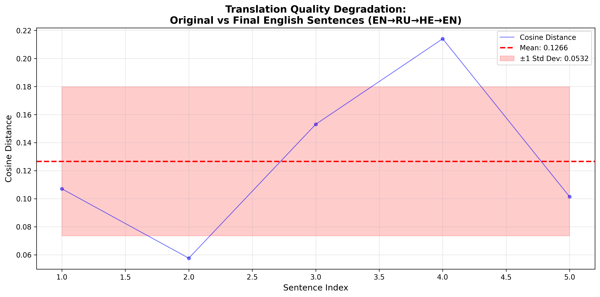

# Translation Quality Assessment Pipeline

A system that evaluates translation quality degradation through sequential multi-language translation. The pipeline processes English sentences through a chain of three translation agents (English → Russian → Hebrew → English) and measures semantic drift using cosine distance metrics.

## Overview

This project quantifies how much meaning is lost when text is translated sequentially through multiple languages. It provides statistical analysis and visualization to understand translation fidelity.

### Translation Chain

```
English → Russian → Hebrew → English
```

Each sentence goes through this complete cycle, and the original and final English versions are compared.

## Features

- **Dual API Support**: Choose between Google Gemini (free tier) or Anthropic Claude
- **Automated Sentence Generation**: Creates diverse English sentences (10-20 words each, configurable count)
- **Multi-Agent Translation**: Three specialized translation agents working in sequence
- **Robust Error Handling**: Automatic retry logic and timeout protection
- **Rate Limit Management**: Configurable wait time between sentences
- **Semantic Similarity Analysis**: Uses sentence embeddings and cosine distance
- **Statistical Analysis**: Mean, variance, and distribution metrics
- **Visualization**: Professional graphs showing quality degradation patterns
- **Progress Tracking**: Real-time progress bars and status updates
- **Intermediate Saves**: Periodic checkpoints to prevent data loss

## Installation

### Prerequisites

- Python 3.8 or higher
- **API Key** (choose one):
  - **Google Gemini API key** (recommended for free tier) - [Get one here](https://aistudio.google.com/app/apikey)
  - **Anthropic API key** - [Get one here](https://console.anthropic.com/account/keys)

### Setup

1. **Clone or download the project**

2. **Install dependencies**:
```bash
pip install -r requirements.txt
```

3. **Configure API key**:
```bash
# Copy the template
cp .env.template .env

# Edit .env and choose your API provider
# Option 1: Using Gemini (Free tier available)
# API_PROVIDER=gemini
# GOOGLE_API_KEY=your-api-key-here

# Option 2: Using Anthropic Claude
# API_PROVIDER=anthropic
# ANTHROPIC_API_KEY=your-api-key-here
```

## Usage

### Basic Usage

Run the pipeline with default settings:

```bash
python main.py
```

The pipeline will:
1. Generate 30 English sentences (configurable)
2. Translate each through EN → RU → HE → EN
3. Calculate cosine distances
4. Generate statistics and visualization
5. Save results to `./results/` directory

**Note:** The pipeline uses the API provider specified in your `.env` file (Gemini or Anthropic)

### Configuration

Edit `config.py` to customize settings:

```python
# Sentence generation
NUM_SENTENCES = 30         # Number of sentences to process
MIN_WORDS = 10            # Minimum words per sentence
MAX_WORDS = 20            # Maximum words per sentence

# Agent settings
AGENT_TIMEOUT = 60        # Seconds before timeout
MAX_RETRIES = 3           # Maximum retry attempts
RETRY_DELAY = 2           # Seconds between retries
WAIT_TIME_BETWEEN_SENTENCES = 30  # Wait time to respect rate limits

# API Provider
API_PROVIDER = "gemini"   # Options: "gemini" or "anthropic"

# Models
GEMINI_MODEL = "gemini-2.0-flash-exp"         # For Gemini provider
ANTHROPIC_MODEL = "claude-3-5-sonnet-20241022"  # For Anthropic provider
EMBEDDING_MODEL = "sentence-transformers/all-MiniLM-L6-v2"
```

## Output

The pipeline generates the following outputs in the `./results/` directory:

### 1. JSON Results (`translation_results.json`)

Complete data including:
- All original and translated sentences
- Cosine distances for each sentence
- Statistical analysis
- Processing metadata

Example structure:
```json
{
  "metadata": {
    "timestamp": "2025-10-28T10:30:00",
    "total_sentences": 100,
    "duration_seconds": 1234.56
  },
  "statistics": {
    "mean": 0.312,
    "variance": 0.045,
    "std": 0.212,
    "min": 0.089,
    "max": 0.678
  },
  "sentences": [...]
}
```

### 2. Visualization (`distance_plot.png`)

A professional graph showing:
- X-axis: Sentence index (1-100)
- Y-axis: Cosine distance
- Mean line with standard deviation band
- Individual data points and trend line

### 3. Intermediate Results

Checkpoint files saved every 10 sentences:
- `intermediate_results_10.json`
- `intermediate_results_20.json`
- etc.

## Project Structure

```
.
├── README.md                    # This file
├── PRD_Translation_Pipeline.md  # Product Requirements Document
├── requirements.txt             # Python dependencies
├── .env.template               # Environment variables template
├── config.py                   # Configuration settings
├── main.py                     # Main entry point
├── pipeline.py                 # Pipeline orchestrator
├── sentence_generator.py       # Sentence generation module
├── translation_agents.py       # Translation agent implementations
├── agent_wrapper.py            # Retry/timeout logic wrapper
├── similarity_calculator.py    # Cosine distance calculator
└── results/                    # Output directory (created automatically)
    ├── translation_results.json
    ├── distance_plot.png
    └── intermediate_results_*.json
```

## Module Documentation

### sentence_generator.py
Generates diverse English sentences using GPT models with fallback to template-based generation.

**Key Class**: `SentenceGenerator`
- `generate_sentences(num, min_words, max_words)`: Main generation method

### translation_agents.py
Implements three specialized translation agents.

**Key Classes**:
- `EnglishToRussianAgent`: EN → RU translation
- `RussianToHebrewAgent`: RU → HE translation
- `HebrewToEnglishAgent`: HE → EN translation
- `TranslationPipeline`: Orchestrates all three agents

### agent_wrapper.py
Provides robust error handling with retry logic and timeouts.

**Key Class**: `AgentWrapper`
- `call_with_retry(agent_func, *args)`: Executes agent with automatic retries
- Raises `AgentTimeoutError` or `AgentMaxRetriesError` on failure

### similarity_calculator.py
Calculates semantic similarity using sentence embeddings.

**Key Class**: `SimilarityCalculator`
- `calculate_cosine_distance(sent1, sent2)`: Single comparison
- `calculate_batch_distances(list1, list2)`: Batch processing
- `calculate_statistics(distances)`: Statistical analysis

### pipeline.py
Main orchestrator that coordinates the entire process.

**Key Class**: `TranslationQualityPipeline`
- `run()`: Execute complete pipeline
- Handles all steps from generation to visualization

## Error Handling

The pipeline includes comprehensive error handling:

### Timeout Protection
- Each agent call has a configurable timeout (default: 60s)
- Pipeline stops if timeout is exceeded after all retries

### Retry Mechanism
- Automatic retries on failure (default: 3 attempts)
- Exponential backoff between retries
- Detailed error logging

### Graceful Failures
- Saves partial results if pipeline is interrupted
- Intermediate checkpoints every 10 sentences
- Clear error messages indicating failure points

### Example Error Scenarios

**Agent Timeout**:
```
⚠ Timeout (60s) on attempt 1/3
⚠ Timeout (60s) on attempt 2/3
⚠ Timeout (60s) on attempt 3/3
PIPELINE STOPPED: Agent timeout after 3 attempts (60s each)
Processed 47 sentences before failure.
Saving partial results...
Partial results saved to: results/partial_results_47_sentences.json
```

**API Rate Limit**:
```
⚠ Error on attempt 1/3: Rate limit exceeded
[Waits 2 seconds]
✓ Success on attempt 2/3
```

## Performance

### Typical Execution Time
- **Total time**: 15-30 minutes for 100 sentences
- **Per sentence**: ~10-20 seconds (3 translations + similarity calculation)
- **Bottleneck**: API calls to translation service

### Optimization Tips
1. Use faster models (e.g., `gpt-3.5-turbo` instead of `gpt-4`)
2. Reduce number of sentences for testing
3. Increase timeout for slower connections
4. Process in batches (modify code)

## Cost Estimation

**Using Google Gemini API** (Default):
- **Per sentence**: 3 API calls (EN→RU, RU→HE, HE→EN)
- **30 sentences**: ~92 API calls
- **Estimated cost**: **FREE** - Gemini API offers generous free tier limits
- **Free tier**: 1,500 requests per day
- [Check current pricing](https://ai.google.dev/pricing)

**Using Anthropic Claude API** (Alternative):
- **Per sentence**: 3 API calls (EN→RU, RU→HE, HE→EN)
- **30 sentences**: ~92 API calls
- **Estimated cost**: ~$0.10-$0.30 (depending on model)
- **Pricing**: Pay-as-you-go based on tokens
- [Check current pricing](https://www.anthropic.com/pricing)

*Recommendation: Use Gemini for development/testing (free tier), switch to Anthropic if needed for production*

## Troubleshooting

### "Missing API key" Error
**For Gemini:**
- Ensure `.env` file exists with valid `GOOGLE_API_KEY`
- Set `API_PROVIDER=gemini` in `.env`
- Or set environment variable: `export GOOGLE_API_KEY=your-api-key-here`

**For Anthropic:**
- Ensure `.env` file exists with valid `ANTHROPIC_API_KEY`
- Set `API_PROVIDER=anthropic` in `.env`
- Or set environment variable: `export ANTHROPIC_API_KEY=your-api-key-here`

### "Timeout after 3 attempts"
- Increase `AGENT_TIMEOUT` in `config.py`
- Check internet connection
- Verify API key is valid and has sufficient quota/credits
- Try switching to the alternative API provider

### "Model not found"
**For Gemini:**
- Update `GEMINI_MODEL` in `config.py`
- Supported models: `gemini-2.0-flash-exp`, `gemini-1.5-pro`, `gemini-1.5-flash`

**For Anthropic:**
- Update `ANTHROPIC_MODEL` in `config.py`
- Supported models: `claude-3-5-sonnet-20241022`, `claude-3-opus-20240229`, `claude-3-haiku-20240307`

### Rate Limit Errors
- Increase `WAIT_TIME_BETWEEN_SENTENCES` in `config.py` (default: 30 seconds)
- Gemini free tier: 1,500 requests/day
- Anthropic: Check your account tier limits

### Embedding model download fails
- Ensure internet connection
- First run downloads the embedding model (~80MB)
- Model is cached for subsequent runs

## Sample Results

Below are screenshots from an actual pipeline execution, demonstrating the complete workflow from initialization to final analysis.

### Pipeline Initialization


The pipeline begins by:
- Checking prerequisites (API provider, API key, output directory)
- Loading the embedding model
- Displaying configuration settings (number of sentences, timeouts, wait times)
- Confirming user readiness to proceed

### Sentence Generation and Translation


Shows the core translation workflow:
- **Step 1**: AI-generated diverse English sentences displayed
- **Step 2**: Real-time translation chain (EN → RU → HE → EN) with timing
- Progress bar showing completion percentage
- Cosine distance calculated for each sentence
- 60-second wait time between sentences to respect API rate limits

### Translation Progress


Continued processing showing:
- Multiple sentences being translated in sequence
- Timing information for each translation step
- Individual cosine distances ranging from 0.0576 to 0.2141
- Progress tracking with estimated time remaining

### Final Results and Statistics


**Step 3: Analysis and Visualization** displays:
- **Statistics Summary**:
  - Average cosine distance: **0.1266**
  - Variance: **0.0028**
  - Standard deviation: **0.0532**
  - Min distance: **0.0576** (highest similarity)
  - Max distance: **0.2141** (lowest similarity)
  - Median distance: **0.1071**
- Output files saved to `./results/` directory
- Total completion time: **2078.72 seconds** (~35 minutes for 5 sentences with 60s wait times)

### Visualization Chart



The distance plot visualization shows:
- **X-axis**: Sentence index (1 through N)
- **Y-axis**: Cosine distance (semantic drift)
- **Blue dots**: Individual sentence distances
- **Red line**: Mean distance (0.1266)
- **Shaded area**: Standard deviation band (±0.0532)
- **Trend line**: Overall pattern of translation quality

**Key Insights from Sample Run**:
- Low average distance (0.1266) indicates good translation quality preservation
- Small variance (0.0028) shows consistent translation performance
- All distances below 0.25 suggest minimal semantic drift
- The translation chain EN → RU → HE → EN maintains semantic integrity well

## Understanding the Results

### Cosine Distance
- **Range**: 0.0 to 2.0
- **0.0**: Identical vectors (perfect semantic match)
- **~0.1-0.3**: Very similar meaning
- **~0.3-0.5**: Moderate similarity
- **~0.5-1.0**: Low similarity
- **>1.0**: Very different or opposite meanings

### Expected Results
- **Average distance**: 0.2 - 0.5 (typical for this translation chain)
- **Variance**: Indicates consistency of degradation
- **Outliers**: Some sentences may degrade more than others

### Interpretation
- Lower average = Better translation quality preservation
- High variance = Inconsistent translation quality
- Patterns in graph may reveal systematic translation issues

## Advanced Usage

### Custom Sentence Generation

Modify `sentence_generator.py` to use your own sentences:

```python
# Replace generate_sentences() with:
sentences = [
    "Your custom sentence one here.",
    "Your custom sentence two here.",
    # ... up to 100 sentences
]
```

### Different Language Chains

Modify `translation_agents.py` to test different language combinations:

```python
# Example: EN → FR → DE → EN
self.agent1 = EnglishToFrenchAgent()
self.agent2 = FrenchToGermanAgent()
self.agent3 = GermanToEnglishAgent()
```

### Alternative Similarity Metrics

Extend `similarity_calculator.py` to include BLEU, ROUGE, or other metrics.

## Contributing

Contributions are welcome! Areas for improvement:
- Additional language pairs
- Alternative embedding models
- Parallel processing for speed
- Web interface for monitoring
- Additional similarity metrics
- Export to different formats

## License

This project is provided as-is for educational and research purposes.

## Citation

If you use this pipeline in research, please cite:

```
Translation Quality Assessment Pipeline
Multi-Agent Translation Degradation Analysis
2025
```

## Support

For issues, questions, or suggestions:
1. Check the troubleshooting section
2. Review the PRD for detailed specifications
3. Examine error logs in console output

## Acknowledgments

- Google Gemini API for translation (primary provider)
- Anthropic Claude API for translation (alternative provider)
- Sentence Transformers for embeddings
- scikit-learn for similarity calculations
- matplotlib for visualization

---

**Version**: 1.0.0
**Date**: 2025-10-28
**Status**: Production Ready
